Utilisateur
===========

*****************
Gestion du compte
*****************

L'utlisateur, une fois connecté, peut accéder à l'espace "Mon compte" disponible en cliquant sur l'image utilisateur située à droite de la barre de navigation principale.
La déconnexion du site s'effectue en cliquant sur "Déconnexion" situé en dessous de l'accès à l'espace "Mon compte".

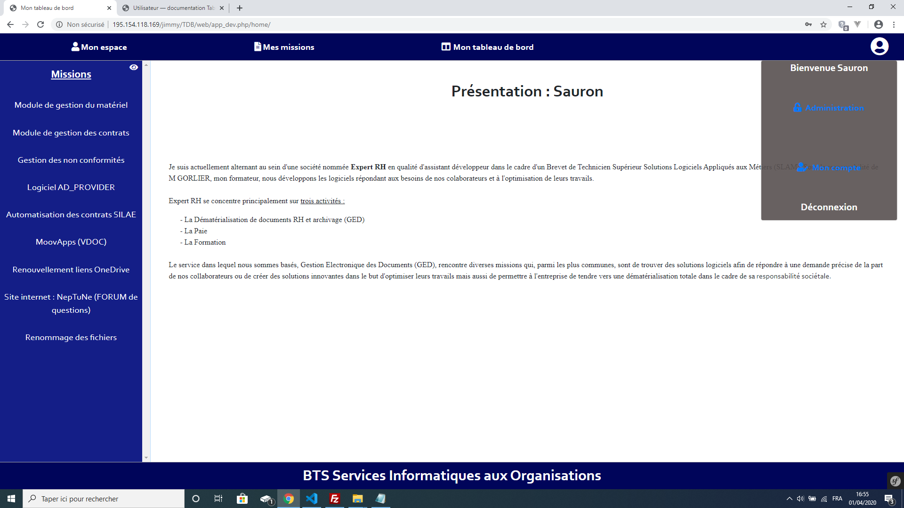

Cet espace permet à l'utilisateur de modifier ses informations personnelles, modifier la présentation de son entreprise, modifier son mot de passe et supprimer son compte. 

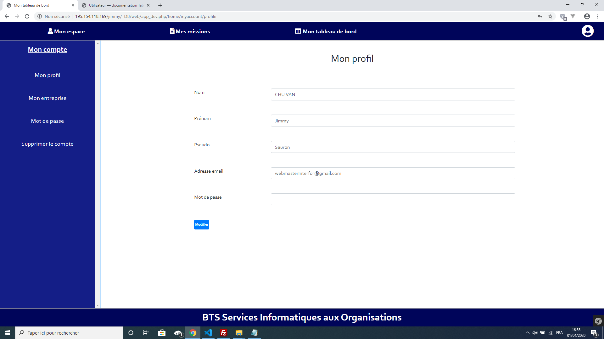

****************************
Présentation de l'entreprise
****************************

La modification de l'entreprise, dans l'espace "Mon compte", permet de créer une page de présentation de votre tableau de bord. 
Elle vous permet de définir une présentation globale de votre poste dans l'entreprise que vous occupez actuellement.

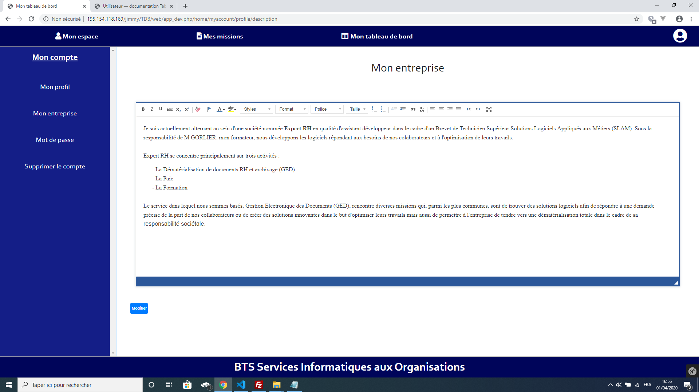

.. note:: La présentation ci-dessous est la page par défaut que les utilisateurs visitant votre profil verront.

**********************
Création d'une mission
**********************

Cliquez sur l'onglet nommé mission en haut de la page dans la barre de navigation. La liste des missions déjà créées apparaît, si il n'y a aucune mission la page ne contiendra que deux boutons : Retour et nouveau.
Cliquez sur le bouton "Nouveau", un nouvelle page s'ouvre. Cette page permet de donner un titre à la mission et de sélectionner la ou les compétence(s) obligatoires parmis les choix de la liste déroulante. 
Chaque mission doit correspondre à au moins une compétence obligatoire.

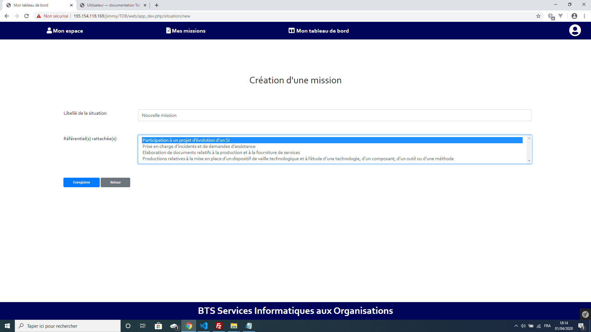

Les missions que vous créez sont disponibles dans la liste des missions, onglet "Mes missions" situé en haut de l'écran dans la barre de navigation principale.

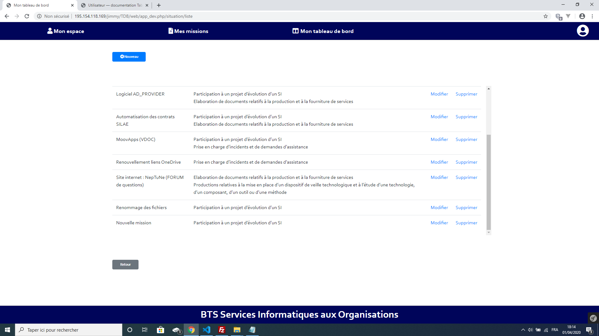

Une fois que la mission est créée, retourner sur votre page d'accueil à l'aide du bouton nommé "Mon espace" en haut à gauche de votre écran dans la barre de navigation principale.
La liste des missions créées apparaît dans la fenêtre de navigation située à gauche de l'écran.

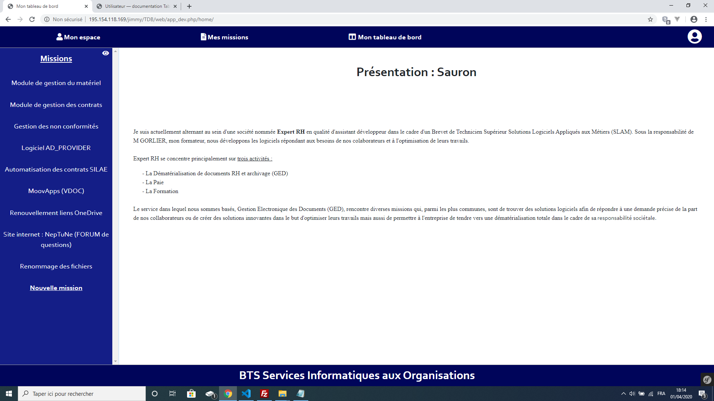

*****************************************************
Création d'une situation effectuée lors de la mission
*****************************************************

Cliquez sur la mission créée puis sélectionnez le bouton nommé "Nouveau".

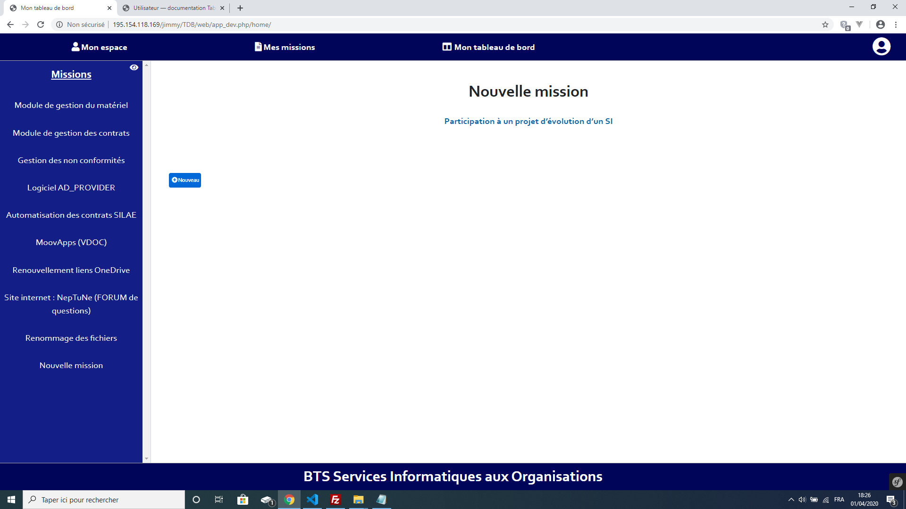

La mission peut comporter plusieurs situation. Une situation correspond à une tâche effectuée lors de votre mission.
Sur la page de création d'une situation sélectionner quelles compétences ont été mises en oeuvre.
Puis renseigner la situation par écrit. Vous avez de la possibilité de joindre des images afin d'illustrer la situation.
Lorsque vous créez une nouvelle situation, celle-ci ne sera pas visualisable tant qu'un administrateur n'aura valider son contenu sous 48 heures. 

.. note:: Le nombre d'image par situation est limité à 10. Si plusieurs images sont jointes à une situation elles apparaîtront sous la forme d'un diaporama lors de la visualisation.

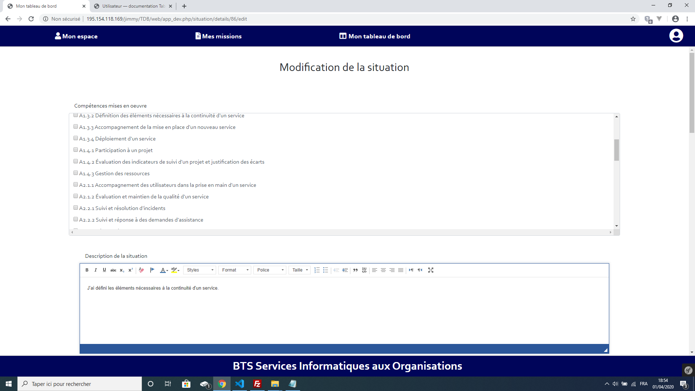

La situation créé est visualisable en cliquant sur la mission située dans la fenêtre de navigation situé à droite de votre écran.

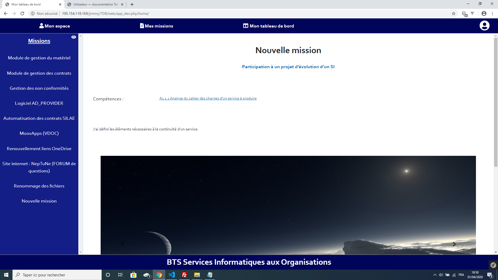

******************************************************
Visualisation des profils et missions des utilisateurs
******************************************************

Vous avez la possibilité de visualiser les profils des utilisateurs inscrits sur le site ainsi que de visualiser leurs missions. 
Dans la barre de navigation des missions située à gauche de votre écran, cliquez sur le bouton en forme d'oeil situé à droite du titre "Mission". 
La liste des utilisateurs apparaît à la place de vos missions.  

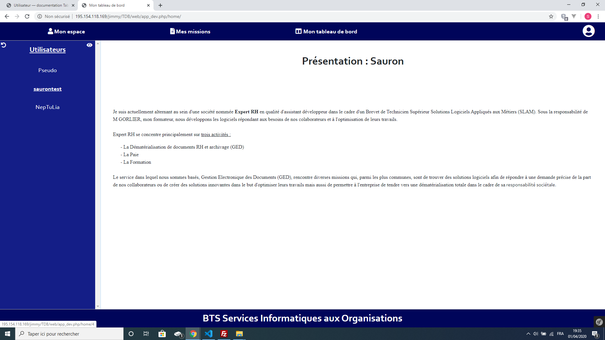

Lorsque vous sélectionner un utilisateur, vous verrez apparaître sa page de présentation ainsi que ses missions qui apparaîtront dans la barre de navigation à gauche de votre écran (celle que vous utilisez pour naviger parmis vos missions).

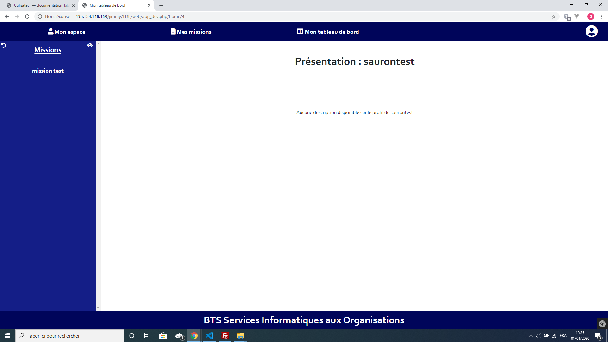

À partir la liste des missions, de l'utilisateur que vous visualisez, cliquez sur l'une d'entre elles pour l'afficher.

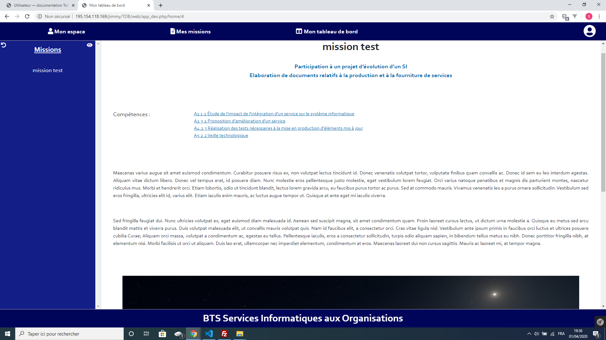